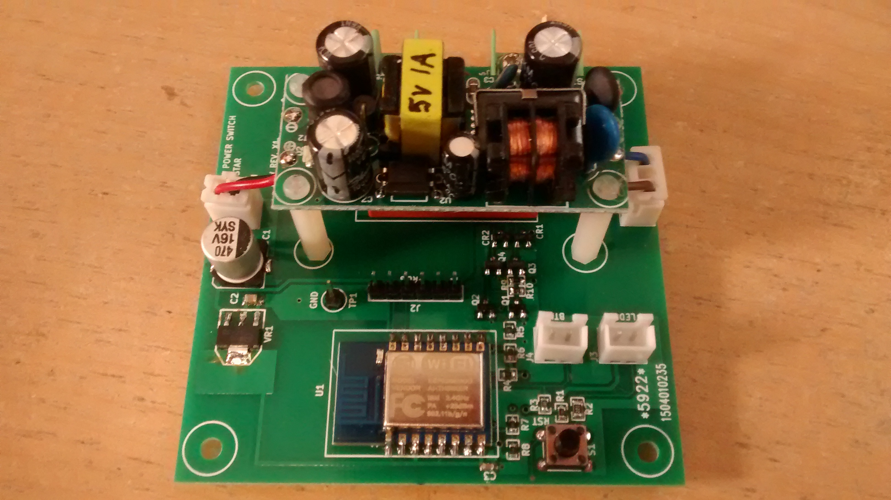

**esp12_appliance_mod**
==========
This is a hardware implementation for the my ESP8266-MQTT-io-node project.

**Features:**

Provides one bistable latching relay channel. Connectors are provided for a link LED and a local button to latch and unlatch the relay.
An dual voltage isolated power supply mounts over the top of the latching relay. 

** EDA Software **

This board was designed using KICAD. 

** Board Size **

15cm x 15 cm.

